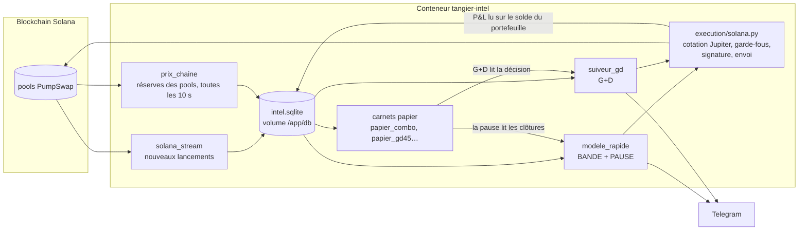
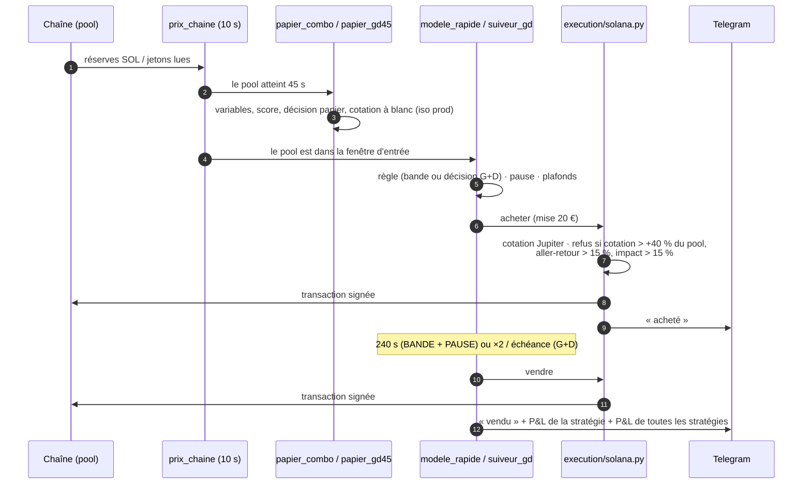
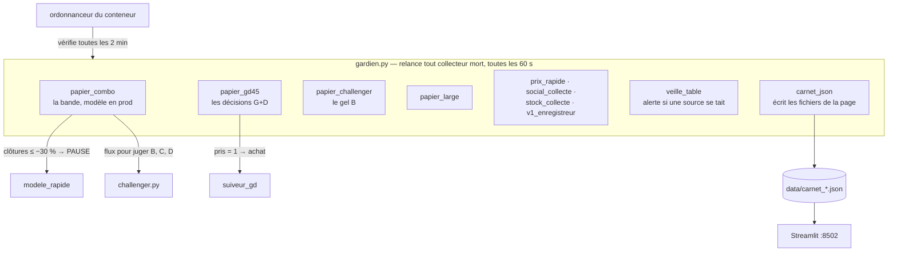
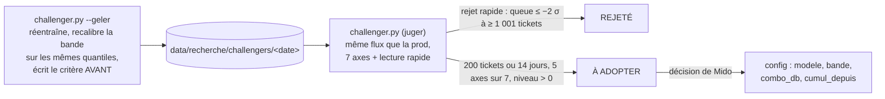

# Architecture — Tangier Intel

État au **27/09/2026**. Ce document décrit ce qui tourne *aujourd'hui*. L'historique des décisions
et des mesures est dans `JOURNAL_RECHERCHE.md` (section 0 = état courant).

---

## 1. Vue d'ensemble

Tangier achète et revend automatiquement des jetons fraîchement lancés sur **Solana (PumpSwap)**,
avec de l'argent réel. Deux stratégies tournent en parallèle, chacune avec sa propre mise :

| stratégie | ce qu'elle achète | décision | sortie | mise |
|---|---|---|---|---|
| **BANDE + PAUSE** | les pools dont le score de risque du modèle est dans la bande [0,20 ; 0,35] | à 45 s d'âge du pool | revente à 240 s | 20 € |
| **G+D** (suiveur) | ce que le carnet papier `papier_gd_direct` a décidé (foule ≤ 74, coffre < 100 SOL, tendance > 0) | à 45 s | prise de gain à ×2, sinon échéance | 20 € |

La **pause** suspend BANDE + PAUSE 30 minutes après chaque clôture de la bande sous −30 %. C'est
un filtre d'*opportunité* : un krach n'annonce pas d'autres krachs, il annonce **moins de gros
gains** (15,7 % contre 22,3 %, §0.2 undecies du journal).



---

## 2. Le parcours d'un ticket



Le **P&L se lit sur le solde réel du portefeuille**, jamais sur une cotation (mémoire
`comptes-depuis-la-chaine`).

---

## 3. Les carnets papier : pourquoi la prod en dépend

Un carnet papier décide **sans acheter**. Trois d'entre eux ne sont pas de la simple recherche :
la production lit leur contenu.



| si ce carnet s'arrête… | conséquence |
|---|---|
| `papier_combo` | la pause ne voit plus rien → BANDE + PAUSE achète sans pause (mesuré : −106 €/jour) |
| `papier_gd45` | G+D n'achète plus rien (il se tait si le carnet est figé) |
| `carnet_json` | la page Streamlit se fige (elle affiche l'âge de ses données) |

**Papier iso prod (27/09).** `papier_combo` demande pour chaque pool la **même cotation que la
prod**, à blanc (`prepare_buy` sans clé), et enregistre si la prod aurait pu acheter et à quel prix
(colonnes `cote_statut`, `prix_cote`). Seules les courbes « ISO PROD » de la page se comparent à
l'argent réel ; les autres surestimaient le gain d'environ ×2.

---

## 4. Faire évoluer le modèle sans casser la prod



Gels en cours : **B** (22/09), **C** (27/09, même cible réentraînée), **D** (27/09, cible
« gros gain »). Le carnet papier `papier_challenger` est épinglé sur B par
`data/recherche/challengers/EN_COURS`.

---

## 5. Carte des dossiers

```text
Tangier/
├── README.md                 point d'entrée
├── CLAUDE.md                 règles de travail (lire la section 0 du journal avant toute action)
├── JOURNAL_RECHERCHE.md      tout ce qui a été mesuré et décidé — section 0 = état courant
├── docker-compose.yml        un seul service : intel
├── Dockerfile.intel          image du moteur
├── config/intel.yaml         TOUS les réglages (mises, bandes, modèles, garde-fous) — relire = redémarrer le moteur
├── intel/                    le code (monté en lecture seule dans le conteneur)
│   ├── engines/              les boucles : modele_rapide, prix_chaine, solana_stream, scheduler…
│   ├── execution/            cotation, garde-fous, signature, envoi (Solana, Jupiter)
│   ├── research/             carnets papier, gardien, verdicts → docs/RECHERCHE_INDEX.md
│   │   └── analyses/         117 analyses ponctuelles terminees (rien n en depend)
│   ├── alerts/  db/  metrics/  providers/  scoring/  chain/  ingest/  …
├── data/                     monté dans le conteneur : page Streamlit, fichiers JSON, modèles,
│   │                         recherche (4,5 Go), sauvegardes (32 Go) — NE RIEN EFFACER
│   ├── carnet_app.py         la page Streamlit
│   ├── table_std2.py         la table des stratégies papier
│   └── recherche/            modèles (balayage/), gels (challengers/), données d'études
├── data_onchain/  data_raw/  données de l'étude on-chain (lues par intel/metrics/regime.py et scripts/)
├── logs/                     journaux (intel.log, un par collecteur)
├── results/                  sorties d'analyses ponctuelles
├── scripts/                  lanceurs Windows (lancer_carnet.cmd, lancer_veille.cmd) et étude on-chain
├── tests/intel_tests/        tests du moteur
├── docs/
│   ├── ARCHITECTURE.md       ce document
│   ├── EXPLOITATION.md       démarrer, arrêter, vérifier, dépanner
│   ├── RECHERCHE_INDEX.md    les 194 scripts de recherche classés par rôle
│   └── historique/           anciennes docs, gardées telles quelles
└── archive/                  projets antérieurs, déplacés le 27/09, rien d'effacé
    ├── 2026-02_bot_ml_binance/        bot ML Binance (main.py, src/, models/…)
    └── 2026-08_allocation_portefeuille/ étude d'allocation (notebooks)
```

Les bases de données vivantes ne sont **pas** dans le dossier : elles sont dans le volume Docker
`tangier_intel_db` (`/app/db` dans le conteneur) — `intel.sqlite`, `papier_*.sqlite`.
